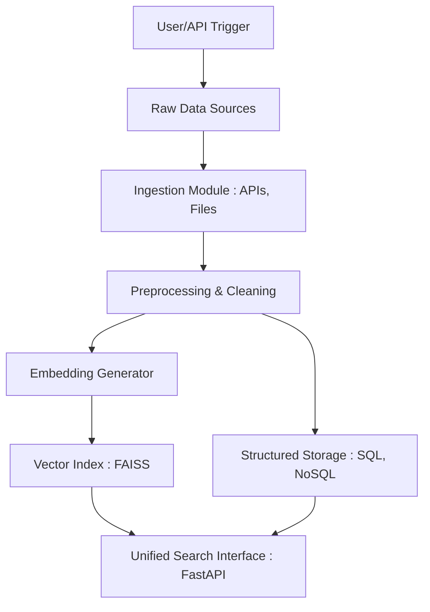
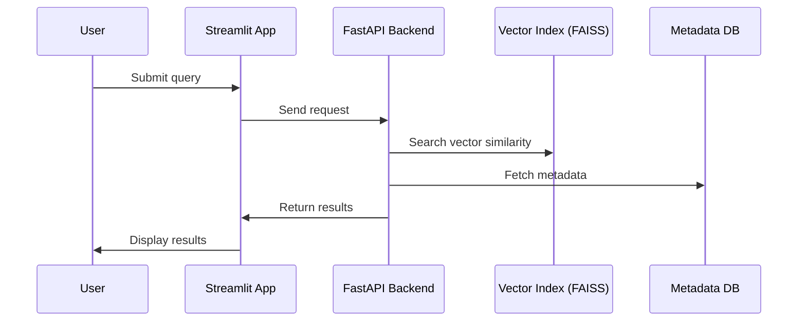

# Multimodal Retrieval System for Materials Discovery

## Objective

Build a production-grade multimodal retrieval system to search and explore materials data from diverse modalities:
- Crystalline structure data (e.g. CIF, POSCAR)
- Scientific publications & patents (text)
- Experimental data (e.g. spectra, images, time series)

The system enables researchers to:
- Retrieve similar materials based on structure or properties
- Perform full-text search on scientific corpora
- Filter/query across structured and unstructured datasets

---

## Architecture Overview


---

## Data Flow Diagram – Ingestion & Indexing



---

## Sequence Diagram – User Research



---

## Project Structure

```bash
multimodal-retrieval-system/
├── app/                          # Main application source code
│   ├── api/                      # FastAPI route definitions
│   ├── core/                     # App settings, logging, constants
│   ├── ingestion/                # Data ingestion from APIs and files
│   ├── preprocessing/            # Cleaning and transformation of raw data
│   ├── embedding/                # Embedding models (text, structure, graph)
│   ├── indexing/                 # FAISS/Elastic indexing and search logic
│   ├── models/                   # Data models and schemas
│   ├── services/                 # Business logic (ranking, hybrid search)
│   └── main.py                   # FastAPI entry point
├── data/                         # Local storage for data and embeddings
│   ├── raw/                      # Raw input files
│   ├── processed/                # Cleaned and transformed data
│   └── embeddings/               # Saved embedding vectors
├── notebooks/                    # Jupyter notebooks for prototyping and EDA
├── scripts/                      # CLI utilities and one-off scripts
├── tests/                        # Unit and integration tests
├── docker-compose.yml
├── Dockerfile
├── pyproject.toml
├── README.md
├── .env.example
└── .gitignore
```
---

## Tech Stack

| Layer        | Tech                              |
|--------------|-----------------------------------|
| Ingestion    | Python, Pydantic, PyMuPDF, Pandas |
| Storage      | PostgreSQL, MongoDB, MinIO/S3     |
| Indexing     | FAISS, Sentence-Transformers      |
| API Backend  | FastAPI, Uvicorn, Pydantic        |
| Frontend     | Streamlit                         |
| Infra        | Docker, Docker Compose, Terraform |
| Monitoring   | Prometheus, Grafana, Sentry       |

---

## Features

- [ ] Ingest structured and unstructured material data
- [ ] Generate embeddings for graph/text/image modalities
- [ ] Store vectors in FAISS for similarity search
- [ ] Serve data and search via FastAPI
- [ ] Visualize results with Streamlit

---

## Getting Started

---

## TODO

---

## Contributions

Pull requests are welcome! Ideas and improvements are greatly appreciated.