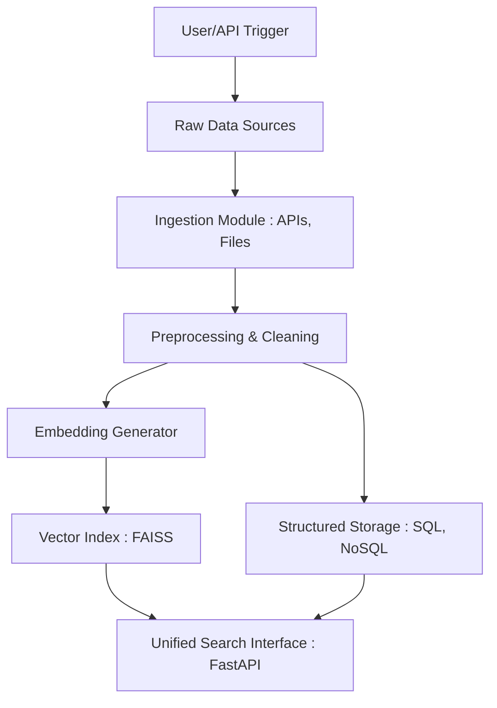
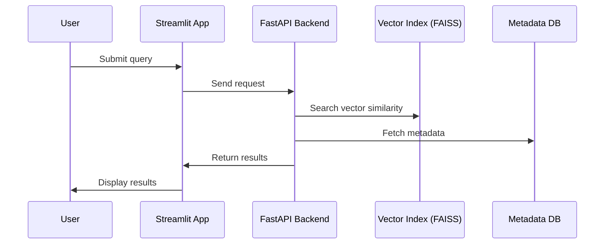

# Multimodal Retrieval System for Materials Discovery

## Objective

Build a production-grade multimodal retrieval system to search and explore materials data from diverse modalities:
- Crystalline structure data (e.g. CIF, POSCAR)
- Scientific publications & patents (text)
- Experimental data (e.g. spectra, images, time series)

The system enables researchers to:
- Retrieve similar materials based on structure or properties
- Perform full-text search on scientific corpora
- Filter/query across structured and unstructured datasets

---

## Architecture Overview


---

## Data Flow Diagram – Ingestion & Indexing



---

## Sequence Diagram – User Research



---

## Project Structure

```bash
multimodal-retrieval-system/
├── app/                          # Main application source code
│   ├── api/                      # FastAPI route definitions
│   ├── core/                     # App settings, logging, constants
│   ├── ingestion/                # Data ingestion from APIs and files
│   ├── preprocessing/            # Cleaning and transformation of raw data
│   ├── embedding/                # Embedding models (text, structure, graph)
│   ├── indexing/                 # FAISS/Elastic indexing and search logic
│   ├── models/                   # Data models and schemas
│   ├── services/                 # Business logic (ranking, hybrid search)
│   └── main.py                   # FastAPI entry point
├── data/                         # Local storage for data and embeddings
│   ├── raw/                      # Raw input files
│   ├── processed/                # Cleaned and transformed data
│   └── embeddings/               # Saved embedding vectors
├── notebooks/                    # Jupyter notebooks for prototyping and EDA
├── scripts/                      # CLI utilities and one-off scripts
├── tests/                        # Unit and integration tests
├── docker-compose.yml
├── Dockerfile
├── pyproject.toml
├── README.md
├── .env.example
└── .gitignore
```
---

## Tech Stack

| Layer        | Tech                              |
|--------------|-----------------------------------|
| Ingestion    | Python, Pydantic, PyMuPDF, Pandas |
| Storage      | PostgreSQL, MongoDB, MinIO/S3     |
| Indexing     | FAISS, Sentence-Transformers      |
| API Backend  | FastAPI, Uvicorn, Pydantic        |
| Frontend     | Streamlit                         |
| Infra        | Docker, Docker Compose, Terraform |
| Monitoring   | Prometheus, Grafana, Sentry       |

---

## Configuration & Environment

The application is configured via **environment variables** (loaded by `pydantic-settings`).

Create a local `.env` from the template and adjust values to your setup:

```bash
cp .env.example .env
```

### Core app
- `MRS_APP_NAME` — Application display name.  
- `MRS_ENV` — One of `local|dev|staging|prod`. Drives conservative defaults (debug, logging).  
- `MRS_DEBUG` — `true|false`. Enables verbose errors in development.

### API
- `MRS_API_PREFIX` — Base path for the REST API (default `/api`).  
- `MRS_HOST` — Bind host for Uvicorn (default `0.0.0.0`).  
- `MRS_PORT` — Bind port (default `8000`).

### Storage
- `MRS_MONGO_URI` — Connection string for MongoDB (e.g. `mongodb://mongo:27017`).  
- `MRS_MONGO_DB` — Database name (default `materials_db`).

### Logging & Observability
- `MRS_LOG_FORMAT` — `json|text`.  
- `MRS_LOG_LEVEL` — `DEBUG|INFO|WARNING|ERROR`.  
- `MRS_LOG_FILE_ENABLED` — `true|false`. If `true`, logs are also written to `LOG_FILE`.  
- `MRS_LOG_FILE` — Path to the log file (e.g. `logs/app.log`).

> **Note:** The default Docker compose maps the service name `mongo` to the MongoDB container. If you run the API outside of compose, set `MONGO_URI=mongodb://localhost:27017` or appropriate host.

### Docker Compose environment

`docker-compose.yml` defines three services:
- `mongodb` — persistent data volume `mongo_data`  
- `faiss_indexer` — sidecar holding/initializing FAISS files (volume `faiss_data`)  
- `fastapi_app` — application container (depends on both)

You can override env values at runtime:

```bash
ENV=local
LOG_LEVEL=DEBUG
docker compose up --build
```

---

## Features

- [ ] Ingest structured and unstructured material data
- [ ] Generate embeddings for graph/text/image modalities
- [ ] Store vectors in FAISS for similarity search
- [ ] Serve data and search via FastAPI
- [ ] Visualize results with Streamlit

---

## Getting Started

1. **Clone repo**
   ```bash
   git clone https://github.com/mk-mkone/multimodal-retrieval-system.git
   cd multimodal-retrieval-system
   ```
2. **Install dependencies (Poetry)**
   ```bash
   poetry install
   ```
3. **Run with Docker**
   ```bash
   make up
   ```

---

## TODO

---

## Contributions

Pull requests are welcome! Ideas and improvements are greatly appreciated.